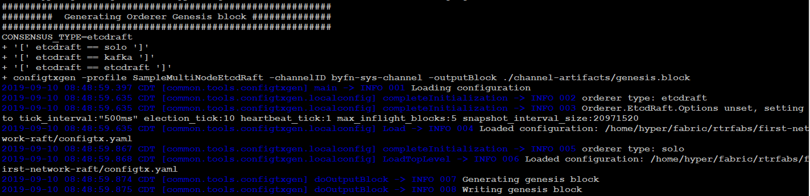
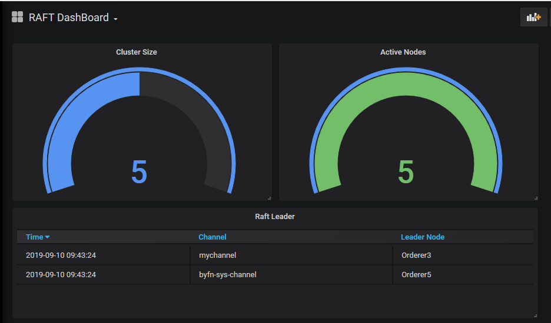
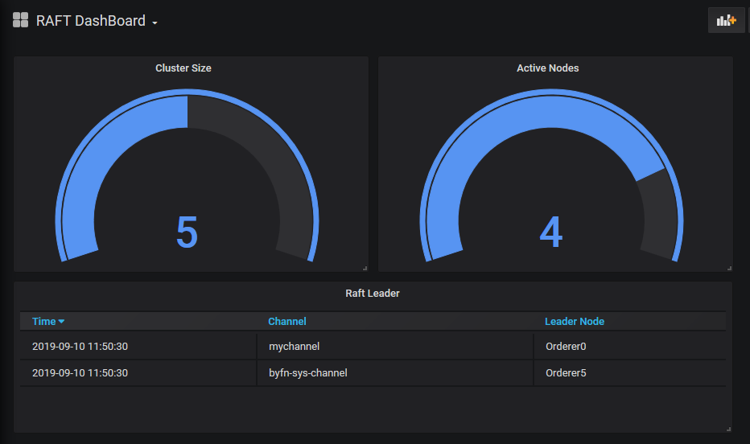
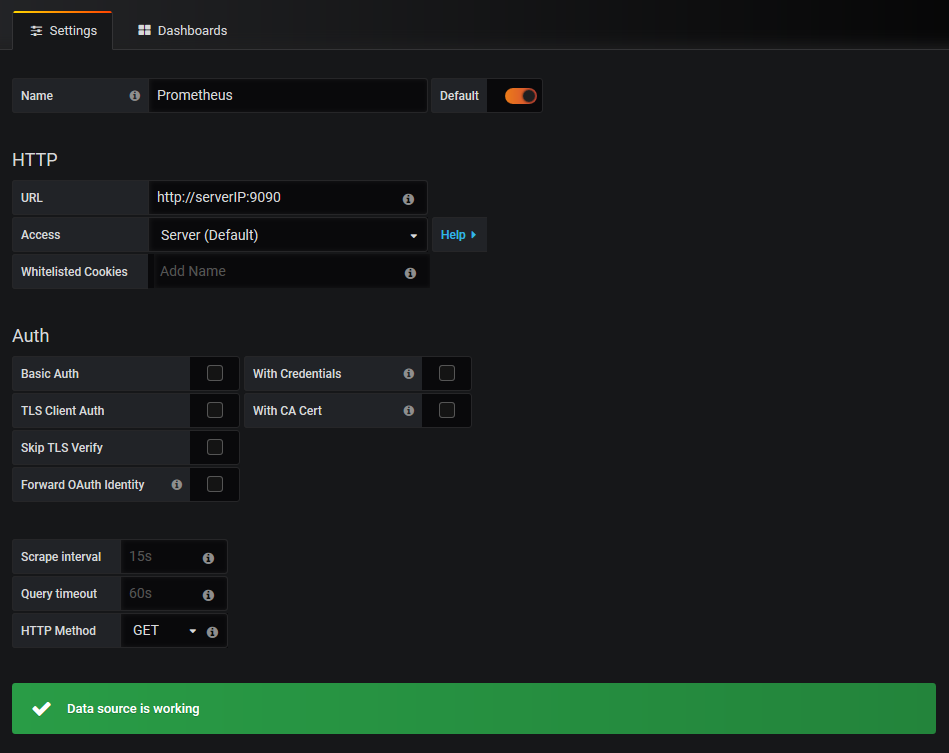

# Raft leader election process in Hyperledger Fabric.

In this article we try to understand the how to election process in raft works by deploying Fabric samples first network using with raft ordering service. 

```bash
cd first-network
# Raft
./byfn.sh generate -o etcdraft
./byfn.sh up -o etcdraft
```

Make sure the the genesis block , channel config is created with orderer type = etcdraft.



For this exercise we will create a simple grafana dashboard to see the cluster size and number of active nodes and the current raft leader by channel.



```
 Elected leader 3 at term 2 channel=mychannel
```


- At any given time raft  nodes  is in one of these states:

  - - **Pre-Candidate:** The pre-candidate first asks other nodes whether pre-candidate can get enough votes to win an election. If not, it would remain as follower.

    - **Candidate** : candidate state, is used during the election process to elect a new leader. 

    - **Leader** : handles all client requests (if a client contacts a follower, the follower redirects it to the leader).

    - **Follower** : Passive: they issue no requests on their own but simply respond to requests from leaders and candidates. If a follower receives no communication from leader ,it becomes a pre-candidate and initiates an election.

      Lets see if we can find out the the process of leader election from the logs.

## Raft Leader Election

In a raft cluster election this is what happens 

**Election**

1. To begin an election, a follower transitions to **pre**-**candidate** state. 

2. After receiving majority pre-vote it becomes **candidate** and starts the election.

3. It then votes for **itself** and issues RequestVote RPCs in parallel to each to the other servers in the cluster. 

4. A **candidate** continues in this state until one of three things happens: (a) it wins the election, (b) another server establishes itself as leader,or (c) a period of time goes by with no winner.

5. A candidate node wins an election and becomes **leader** if it receives votes from a **majority** of the servers in the full cluster for the same term. 

   

Based on above steps lets see how the orderer3 became the leader for mychannel from the logs.

docker logs orderer3.example.com

```bash
#Step0 Node3 starts election becomes Pre-Candidate
Step -> INFO 048 3 is starting a new election at term 1 channel=mychannel node=3
becomePreCandidate -> INFO 049 3 became pre-candidate at term 1 channel=mychannel node=3
poll -> INFO 04a 3 received MsgPreVoteResp from 3 at term 1 channel=mychannel node=3

#Step2 Node3 Sends MsgPreVote to all nodes in cluster.
campaign -> INFO 04b 3 [logterm: 1, index: 5] sent MsgPreVote request to 1 at term 1 channel=mychannel node=3
campaign -> INFO 04c 3 [logterm: 1, index: 5] sent MsgPreVote request to 2 at term 1 channel=mychannel node=3
campaign -> INFO 04d 3 [logterm: 1, index: 5] sent MsgPreVote request to 4 at term 1 channel=mychannel node=3
campaign -> INFO 04e 3 [logterm: 1, index: 5] sent MsgPreVote request to 5 at term 1 channel=mychannel node=3

#Node 3 Starts Receving Response from other Nodes
poll -> INFO 04f 3 received MsgPreVoteResp from 5 at term 1 channel=mychannel node=3
stepCandidate -> INFO 050 3 [quorum:3] has received 2 MsgPreVoteResp votes and 0 vote rejections channel=mychannel node=3
poll -> INFO 051 3 received MsgPreVoteResp from 2 at term 1 channel=mychannel node=3

#Step3 Node3 receives majority 3 / 5 MsgPreVoteResp from all nodes
stepCandidate -> INFO 052 3 [quorum:3] has received 3 MsgPreVoteResp votes and 0 vote rejections channel=mychannel node=3

# Step4 Node3 incrementes term 1 to term 2 becomes candidate.
becomeCandidate -> INFO 053 3 became candidate at term 2 channel=mychannel node=3
# Step5 Node3 votes for itself
poll -> INFO 054 3 received MsgVoteResp from 3 at term 2 channel=mychannel node=3

# Step6 Node3 sends MsgVote request to to other nodes.
campaign -> INFO 055 3 [logterm: 1, index: 5] sent MsgVote request to 1 at term 2 channel=mychannel node=3
campaign -> INFO 056 3 [logterm: 1, index: 5] sent MsgVote request to 2 at term 2 channel=mychannel node=3
campaign -> INFO 057 3 [logterm: 1, index: 5] sent MsgVote request to 4 at term 2 channel=mychannel node=3
campaign -> INFO 058 3 [logterm: 1, index: 5] sent MsgVote request to 5 at term 2 channel=mychannel node=3

# Step7  Node 3 starts receving MsgVoteResp from other nodes
poll -> INFO 059 3 received MsgVoteResp from 4 at term 2 channel=mychannel node=3
stepCandidate -> INFO 05a 3 [quorum:3] has received 2 MsgVoteResp votes and 0 vote rejections channel=mychannel node=3
poll -> INFO 05b 3 received MsgVoteResp from 5 at term 2 channel=mychannel node=3

# Step8 Node3 receives majority votes 3 / 5 
stepCandidate -> INFO 05c 3 [quorum:3] has received 3 MsgVoteResp votes and 0 vote rejections channel=mychannel node=3

# Step9 Node3 becomes elected as leader
becomeLeader -> INFO 05d 3 became leader at term 2 channel=mychannel node=3

run -> INFO 05e raft.node: 3 elected leader 3 at term 2 channel=mychannel node=3
run -> INFO 05f Leader 3 is present, quit campaign channel=mychannel node=3
serveRequest -> INFO 060 Raft leader changed: 0 -> 3 channel=mychannel node=3

# Step10 Node3 starts receiving requests as leader
serveRequest -> INFO 061 Start accepting requests as Raft leader at block [0] channel=mychannel node=3
propose -> INFO 062 Created block [1], there are 0 blocks in flight channel=mychannel node=3

```


#### Leader election after node failure

Lets simulate a node failure by stopping the Node3 which is the leader for mychannel.

- docker stop orderer3.example.com.
- We can see the number of nodes active is now 4.
- And the **new leader** has been elected **Node1** which is orderer.example.com.



Lets inspect the docker logs orderer.example.com.

```bash
run -> INFO 095 raft.node: 1 lost leader 3 at term 4 channel=mychannel node=1

#Step1 Node1 Starts election Process
Step -> INFO 08e 1 is starting a new election at term 4 channel=mychannel node=1
becomePreCandidate -> INFO 08f 1 became pre-candidate at term 4 channel=mychannel node=1
poll -> INFO 090 1 received MsgPreVoteResp from 1 at term 4 channel=mychannel node=1
campaign -> INFO 091 1 [logterm: 4, index: 12] sent MsgPreVote request to 5 at term 4 channel=mychannel node=1
campaign -> INFO 092 1 [logterm: 4, index: 12] sent MsgPreVote request to 2 at term 4 channel=mychannel node=1
campaign -> INFO 093 1 [logterm: 4, index: 12] sent MsgPreVote request to 3 at term 4 channel=mychannel node=1
campaign -> INFO 094 1 [logterm: 4, index: 12] sent MsgPreVote request to 4 at term 4 channel=mychannel node=1
run -> INFO 095 raft.node: 1 lost leader 4 at term 4 channel=mychannel node=1


```

We can see that the process repeats with Node1 becoming precandidate then candidate and then gets elected.

- Now let us rejoin the node we stopped by starting the docker container.
- After rejoining the node tries start and election by becoming pre-candidate  
- But fails to get pre-votes majority and becomes a follower and elects the existing leader.

```bash
Step -> INFO 0b5 3 is starting a new election at term 5 channel=mychannel node=3
becomePreCandidate -> INFO 0b6 4 became pre-candidate at term 5 channel=mychannel node=3

campaign -> INFO 0bf 3 [logterm: 4, index: 12] sent MsgPreVote request to 1 at term 5 channel=mychannel node=3
campaign -> INFO 0c0 3 [logterm: 4, index: 12] sent MsgPreVote request to 2 at term 5 channel=mychannel node=3
campaign -> INFO 0c1 3 [logterm: 4, index: 12] sent MsgPreVote request to 3 at term 5 channel=mychannel node=3
campaign -> INFO 0c2 3 [logterm: 4, index: 12] sent MsgPreVote request to 5 at term 5 channel=mychannel node=3
poll -> INFO 0be 3 received MsgPreVoteResp from 3 at term 5 channel=mychannel node=3
becomeFollower -> INFO 0c3 3 became follower at term 5 channel=mychannel node=3
run -> INFO 0c4 raft.node: 3 elected leader 1 at term 5 channel=mychannel node=3
```


## Metrics

We will configure Prometheus and Grafana to explore cluster and consensus  related metrics. Refer this [link](https://hyperledger-fabric.readthedocs.io/en/latest/metrics_reference.html) for all available metrics.

Before starting network add the below lines under orderer-base environment variables.

```bash
      - ORDERER_OPERATIONS_LISTENADDRESS=0.0.0.0:8443
      - ORDERER_METRICS_PROVIDER=prometheus 
```

Configure the [prometheus.yml](prometheus/prometheus.yml) as per your model.

```bash
docker-compose -f docker-compose-prom.yaml up -d
```

Make sure the Prometheus is running after the deployment. http://serverIP:9090/graph


Now lets configure grafana

Add Prometheus as data source to grafana . http://serverIP:3000/datasources



We will create a simple grafana dashboard. 

```bash
consensus_etcdraft_is_leader>0
consensus_etcdraft_cluster_size{channel="byfn-sys-channel"}
count(consensus_etcdraft_is_leader{channel="byfn-sys-channel"})
```


##### Reference

https://kubernetes.io/blog/2019/08/30/announcing-etcd-3-4/

https://raft.github.io/raft.pdf


